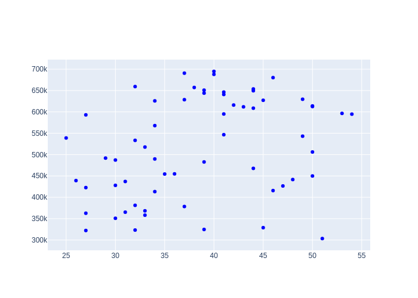
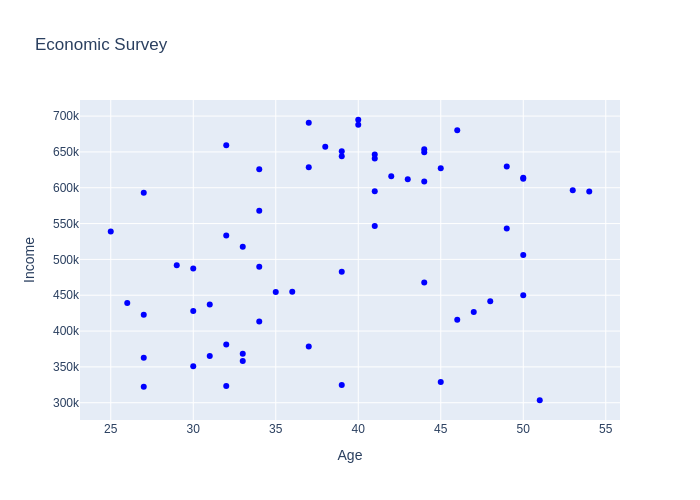
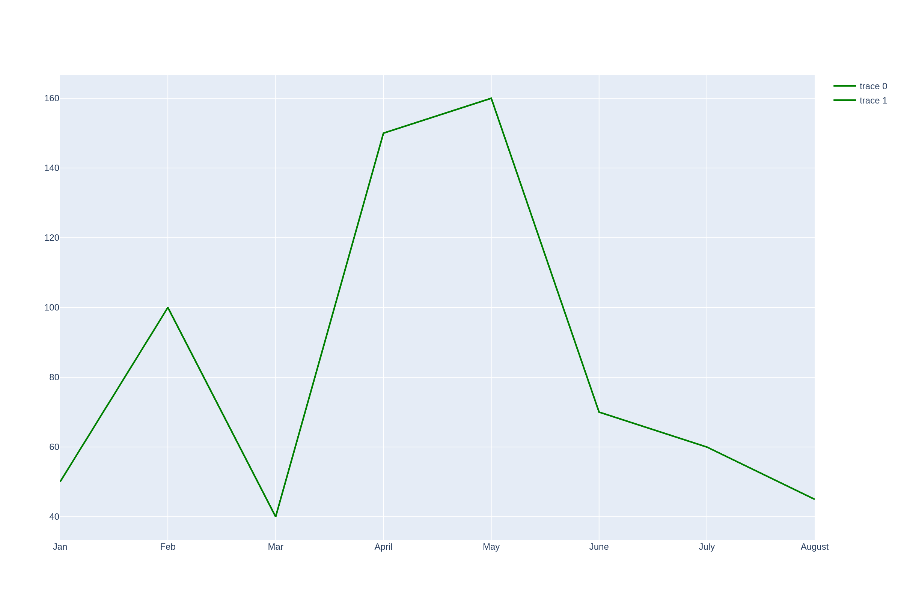
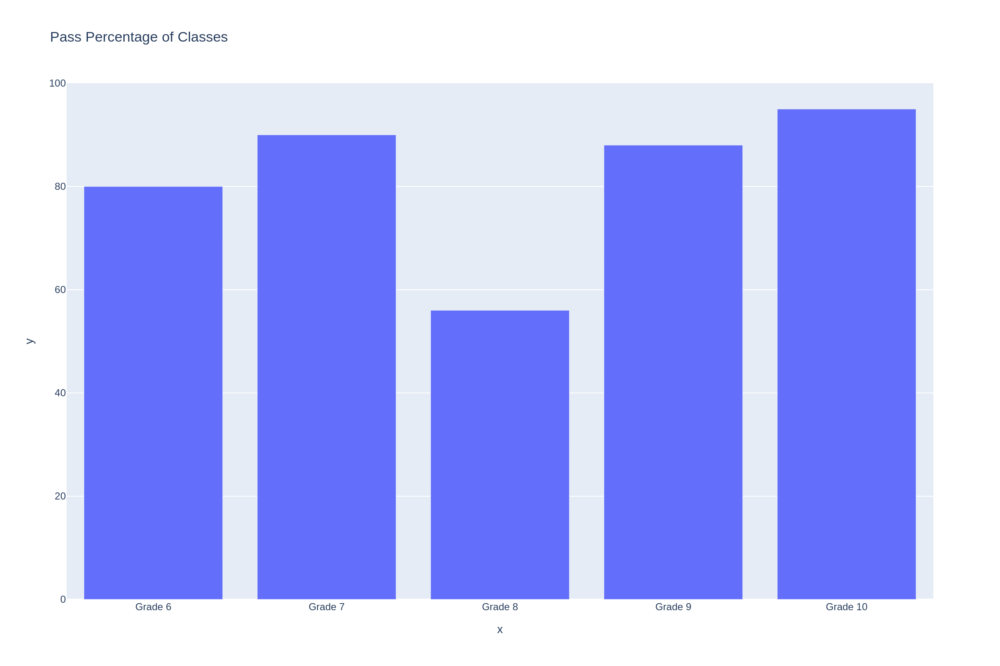
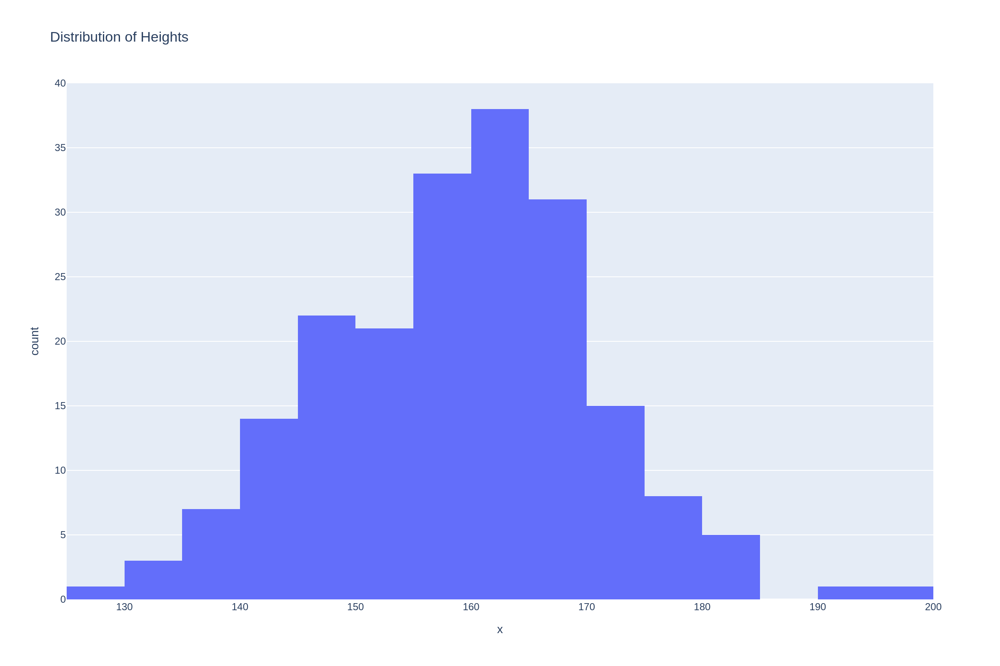
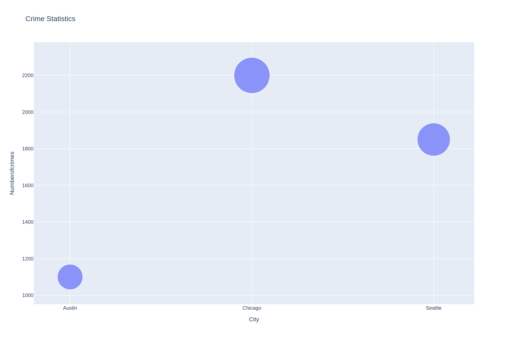
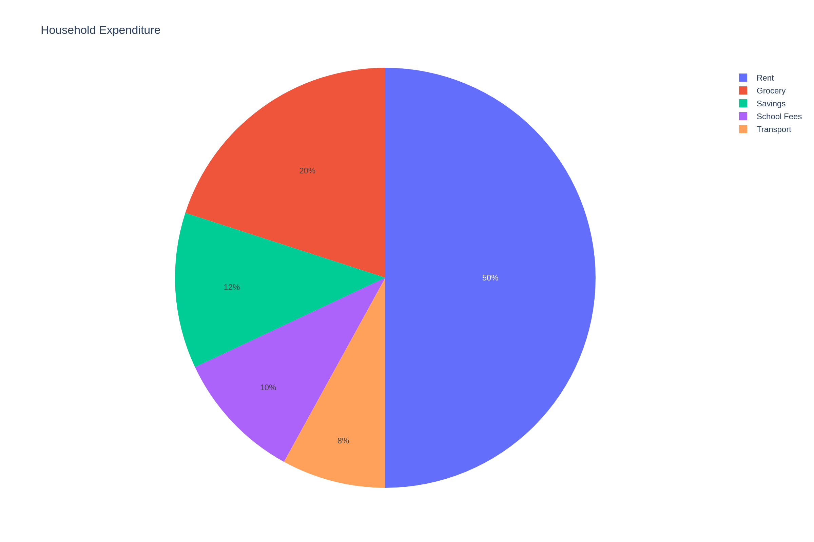
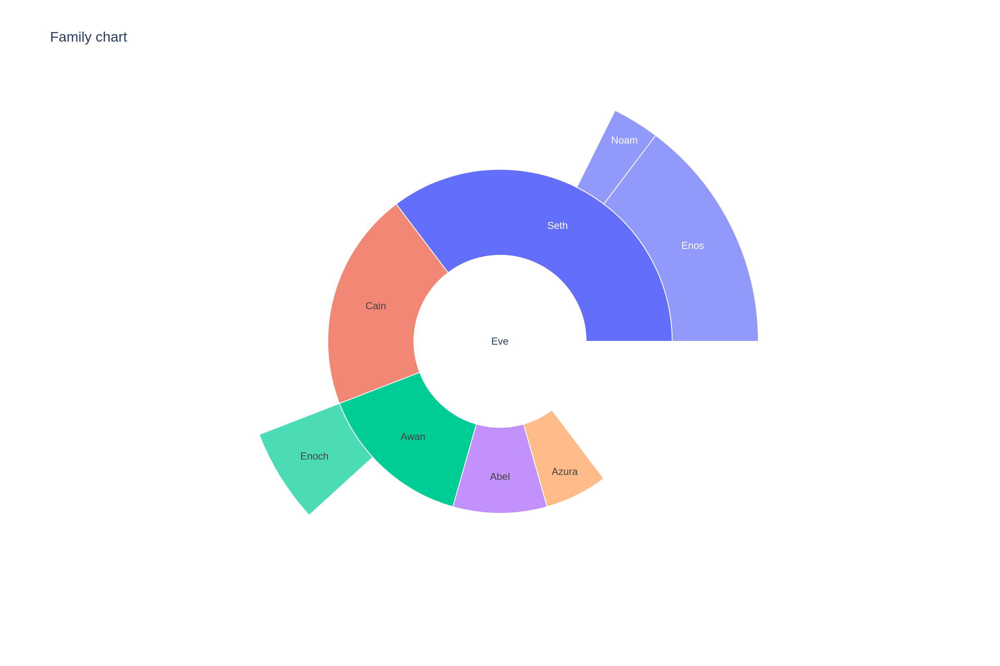

# working-with-plotly
# 📊 Plotly Data Visualization Project

## 📌 Overview
This project demonstrates the creation of interactive and exportable data visualizations using the Plotly library in Python. Various chart types are implemented to analyze and present data clearly and professionally.

All visualizations are saved as high-resolution image files suitable for reports, presentations, and portfolio use.

---

---

## 🛠 Technologies Used

- Python
- Plotly
- Plotly Express
- NumPy
- Kaleido (for saving images)
- Jupyter Notebook

---

## 📈 Visualizations Created

### 1. Scatter Plot

- Shows relationship between age and income
- Helps identify income distribution across age groups

---

### 2. Scatter Plot with Titles

- Improved scatter plot with axis labels and title
- Represents economic survey data clearly

---

### 3. Line Plot

- Shows monthly bicycle sales trend
- Useful for identifying growth and decline periods

---

### 4. Bar Chart

- Displays pass percentage across different classes
- Helps compare performance between grades

---

### 5. Histogram

- Shows distribution of heights
- Helps understand frequency distribution

---

### 6. Bubble Chart

- Displays crime statistics by city
- Bubble size represents number of crimes

---

### 7. Pie Chart

- Shows household spending distribution
- Useful for budget analysis

---

### 8. Sunburst Chart

- Shows hierarchical family structure
- Demonstrates hierarchical data visualization

---

 Run all cells

---

## 📊 Skills Demonstrated

- Data visualization
- Plotly chart creation
- Exporting charts as images
- Data analysis visualization techniques
- Professional reporting visuals

---

## 📚 Applications

These visualizations are useful for:

- Data Analysis
- Business Reports
- Dashboard Development
- Portfolio Projects
- Academic Projects

---

## ⭐ Key Learning Outcome

This project demonstrates complete mastery of Plotly visualization including:

- Scatter plots
- Line charts
- Bar charts
- Histograms
- Bubble charts
- Pie charts
- Sunburst charts
- Saving visualizations as high-quality images
